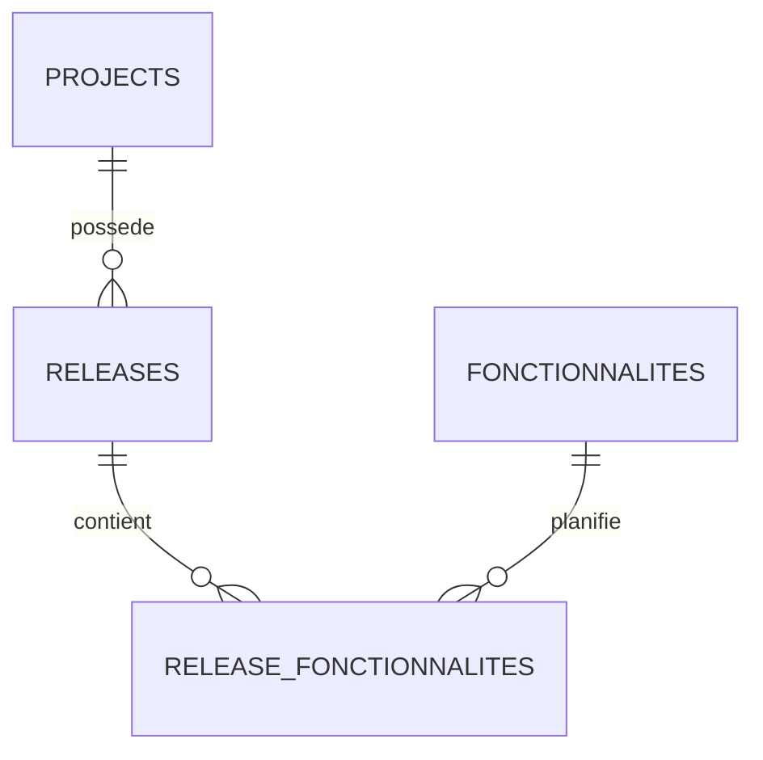
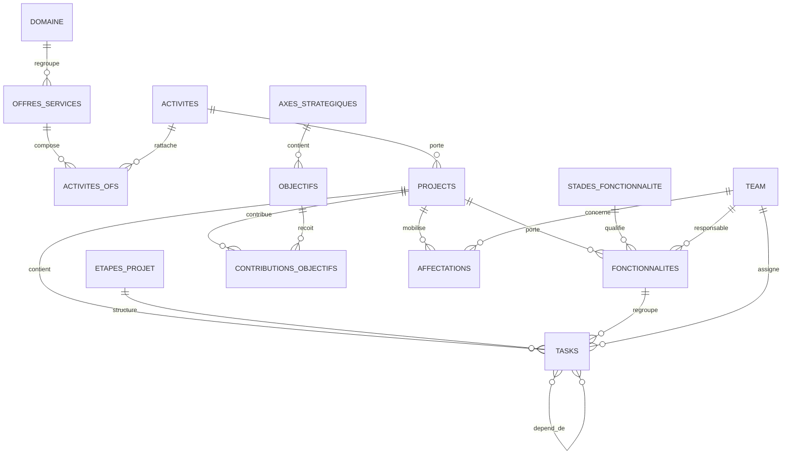

# MCD — GRIST. COCKPIT Pilotage PMO
**Version 4.8.0 — 13 août 2026**

## Extension Releases

Une Release est un objet métier borné dans le temps, rattaché à un Projet ou Produit et constitué de Fonctionnalités.

- Projet -> Releases <-> Fonctionnalites
- Produit -> Releases <-> Fonctionnalites
- Les tâches restent rattachées aux fonctionnalités ; la Release ne contient pas directement les tâches.

---

# MCD — GRIST. COCKPIT Pilotage PMO
**Version 4.7.7 — 13 août 2026**

## Vue conceptuelle

## Règles métier consolidées
- `Projects` représente soit un **Projet**, soit un **Produit**.
- **Projet** : borné (`dateDebut`, `dateFin`), piloté par `Etapes_Projet`.
- **Produit** : potentiellement non borné, sans étape projet, piloté par `Fonctionnalites`.
- Une `Fonctionnalite` peut appartenir à un Projet ou à un Produit.
- Une fonctionnalité possède `stade`, `Date_Debut`, `Date_Fin`, éventuellement `Date_Cible`, `Progression`, `Priorite`, `Responsable`.
- Une tâche Projet référence `etape_projet` et peut aussi référencer `fonctionnalite`.
- Une tâche Produit ne référence pas d'étape projet et peut référencer une fonctionnalité.
- `Tasks.dependDe` est une `RefList -> Tasks` globale : les dépendances peuvent être inter-projets/inter-produits.
- Le CRUD `Fonctionnalites` est **exclusivement dans le Cockpit**.
- `Stades_Fonctionnalite`, `Etapes_Projet`, `Domaine` et les autres référentiels restent administrés dans **Admin & Audit**.

## Chaîne Projet
`Domaine -> Offre de services -> Activité -> Projet -> Étape -> Tâche`

En parallèle : `Projet -> Fonctionnalité`, et une tâche peut pointer vers cette fonctionnalité.

## Chaîne Produit
`Domaine -> Offre de services -> Activité -> Produit -> Fonctionnalité -> Tâche`

Aucune étape projet.

## Dépendances transverses
`Projet A -> Tâche A3 -> dependDe -> Tâche B7 -> Projet B`

## Objets et responsabilités
| Objet | Nature | Relations clés |
|---|---|---|
| Projects | Métier | Activité, Tasks, Fonctionnalites, Objectifs, Affectations |
| Tasks | Métier | Projects, Etapes_Projet, Fonctionnalites, Team, Tasks(dependDe) |
| Fonctionnalites | Métier | Projects, Stades_Fonctionnalite, Team |
| Etapes_Projet | Référentiel | Tasks ; utilisé uniquement par les Projets |
| Stades_Fonctionnalite | Référentiel | Fonctionnalites |
| Domaine | Référentiel | Offres_Services |
| Offres_Services | Référentiel | Domaine, Activites_OFS |
| Activites | Référentiel | Activites_OFS, Projects |
| CONTRIBUTIONS_OBJECTIFS | Liaison | Projects <-> Objectifs |
| AFFECTATIONS | Liaison | Projects <-> Team |

---

# ARCHITECTURE.md — V4 adaptée au modèle réel

Grist est l'unique source de vérité.

## Modèle opérationnel
Projects → Tasks
Projects → Allocations → Team
Tasks.assignees → Team
Tasks.dependDe → Tasks
Tasks.parentTask → Tasks

## Modèle stratégique
Axes_Strategiques → Objectifs → CONTRIBUTIONS_OBJECTIFS → Projects

Attention : `CONTRIBUTIONS_OBJECTIFS.Projet_Code` est une **RefList:Projects**.
Toute écriture doit utiliser une valeur Grist RefList de forme `["L", projectId, ...]`.

## Modèle offre / activité
Projects.activite → Activites
Activites.Service_Code → Activites_OFS
Activites_OFS.OFS_Code → Offres_Services

Ne pas introduire une table `Services` fictive dans le widget : elle n'est pas utilisée par le modèle réel.

## Règles
- aucun localStorage / IndexedDB pour les données métier;
- après toute écriture, relecture depuis Grist;
- toute suppression est confirmée;
- ne jamais recréer automatiquement une ligne supprimée;
- conserver les IDs de colonnes réels du modèle actuel.

## V4.1 — Pilotage opérationnel

La V4.1 n'ajoute aucune table et ne change pas le schéma.

Elle calcule uniquement des vues dérivées :
- alertes projet ;
- progression calculée ;
- charge ressource ;
- dépendances visuelles du Gantt.

Aucune de ces données dérivées n'est persistée côté navigateur ni réécrite automatiquement dans Grist.

## V4.2.0 — Offre, CRUD et Projet / Produit

### Typologie portefeuille

`Projects.Type` est la source de vérité pour distinguer :
- Projet
- Produit

Cette distinction est uniquement une dimension métier du même référentiel `Projects`.
Aucune table `Produits` séparée n'est créée.

### Vue Offre

La vue Offre agrège les objets `Projects` de type Projet ou Produit à travers :

`Projects.activite -> Activites.Service_Code -> Activites_OFS.OFS_Code -> Offres_Services`

### Administration

Le CRUD porte sur les référentiels maîtres.
Une suppression est interdite tant qu'une dépendance connue existe.
Le widget ne fait aucune suppression en cascade automatique sur les référentiels.

## V4.3.0 — Refonte UI PMO

Le schéma de données est inchangé.

### Navigation
Le menu de niveau 1 est placé dans le header global :
- Pilotage par projets / produits
- Pilotage par offre de services
- Administration

Le nom d'un projet/produit n'est rendu que dans le contexte de la vue Projet / Produit.

### Vue portefeuille
La vue Projet / Produit est divisée en :
- agrégats portefeuille ;
- liste filtrable / recherchable ;
- détail sélectionné ;
- sous-navigation du détail.

### Principe
Aucune donnée dérivée affichée dans les KPI ou synthèses n'est persistée automatiquement.
Grist reste l'unique source de vérité.

## Correctif V4.3.1

Correction d'une erreur de syntaxe dans l'initialisation des événements de la V4.3.0.
Cette erreur empêchait complètement l'exécution JavaScript et donc tout accès aux tables Grist.

La V4.3.1 conserve exactement le même modèle de données et la même UI, mais restaure le binding dynamique avec Grist.

## Correctif V4.3.2

Réintroduction de l'élément UI `#objectiveCount`, requis par `strategy()`.
Le helper `$()` lève désormais une erreur explicite avec l'identifiant manquant,
afin de faciliter le diagnostic des futures régressions UI.

## V4.4
Projects.etape_courante -> Etapes_Projet; Tasks.etape_projet -> Etapes_Projet; Fonctionnalites.produit -> Projects; Fonctionnalites.stade -> Stades_Fonctionnalite; Tasks.fonctionnalite -> Fonctionnalites.

## V4.5
Le cockpit principal est désormais strictement métier. Aucun référentiel n’est dupliqué : le widget Admin utilise le même document Grist.

## V4.5.1 — Audit fonctionnel

Le Cockpit alimente `JOURNAL_ACTIONS` lorsqu'elle est disponible.
Le champ `Details` conserve un diff avant/après pour les updates et l'état avant suppression.
L'identité utilisateur doit être renseignée côté Grist par trigger formula si souhaitée.

## V4.5.2 — Synthèse projet

Le sous-onglet `Infos` devient `Synthèse`.
Il agrège des indicateurs calculés en lecture depuis les tables Grist, sans nouvelle persistance.

## V4.5.3
Suppression des appels aux anciens renderers `business()` et `alerts()` dont les conteneurs DOM
ont disparu avec le remplacement de l'onglet Infos par Synthèse.

## V4.5.4

Le CRUD `Projects` couvre maintenant Create + Update + Delete depuis le cockpit.
Le sous-onglet par défaut du détail est `infos`, affiché sous le libellé `Synthèse`.

## V4.5.5 — Météo

`Projects.Meteo_Projet` et `Projects.Motif_Meteo` deviennent les sources de vérité préférées pour
la météo affichée dans la fiche. Un fallback calculé reste présent tant que les formules Grist ne sont
pas encore configurées.

## V4.5.6

Nettoyage des renderers hérités de l'ancienne vue Infos.
Le cockpit ne référence plus de conteneurs DOM supprimés.

## V4.6.0

Projet → Etapes_Projet → Tasks est exposé comme Planning projet.
Produit → Fonctionnalites → Tasks est exposé comme Roadmap produit.

## V4.6.1
Filtres cumulables Type + Domaine + Service + Recherche.

## V4.6.2

Correction purement UI/responsive du bandeau portefeuille.
Aucun changement du modèle Grist ni de la logique de filtrage.

## V4.6.3
Responsabilités :
- Cockpit : CRUD Fonctionnalites
- Admin & Audit : CRUD Stades_Fonctionnalite uniquement pour le référentiel de stades

## V4.7.0
Projet: Projects -> Etapes_Projet -> Tasks, avec Tasks -> Fonctionnalites facultatif.
Produit: Projects -> Fonctionnalites -> Tasks, sans Etapes_Projet.

## V4.7.1
Les dépendances de tâches sont globales au portefeuille et peuvent traverser les projets/produits.

## V4.7.2
La Synthèse analyse `Tasks.dependDe` et distingue les dépendances internes des dépendances inter-projets.
Une dépendance externe en retard est remontée comme alerte PMO.

## V4.7.3
Correction du renderer météo.
Ajout d'un accès direct Synthèse -> Fonctionnalités pour rendre le CRUD métier explicite.

## V4.7.4
Restauration des renderers métier historiques appelés par `renderProject()`.

## V4.7.5
Restauration complète du renderer de la vue Offre de services.

## V4.7.6
Restauration de `projectsForOffer()` et contrôle de complétude des fonctions historiques du cockpit.

## V4.7.8 — Classification
`Projects.Type` = Projet / Produit.
`Projects.Nature_Projet` = Métier / Support.
Ces deux dimensions ne doivent pas être confondues.

## V4.8.1 — UI hybride

Le nouveau cadre de pilotage est appliqué uniquement au bandeau portefeuille.
La navigation et la fiche projet existantes restent fonctionnellement inchangées.

## V4.8.2 — Navigation portefeuille
La navigation passe d'une liste latérale à un tableau portefeuille pleine largeur.
La fiche détaillée existante reste inchangée et s'affiche sous la liste.

## V4.8.3 — Navigation interne
Le module Pilotage possède deux états d'écran : `portfolioPage` et `projectPage`.
La fiche n'est plus affichée sous la liste ; elle remplace la liste jusqu'au retour utilisateur.

## V4.8.4 — Préférences de vue portefeuille
La sélection des colonnes est une préférence UI stockée dans `localStorage`.
Elle n'altère jamais le schéma ni les données Grist.

## V4.8.5 — Relation Releases / Fonctionnalités
La table de liaison `Release_Fonctionnalites` est pilotable depuis les deux objets métier :
Release -> Fonctionnalités et Fonctionnalité -> Releases.

## V4.8.6
Le CRUD Projects utilise un diff de champs et filtre les colonnes à partir du schéma réellement lu dans Grist.

## V4.9.0 — Documentation dynamique
Source : table `Documentation`. Admin = CRUD ; Cockpit = restitution en lecture.

## V4.9.1
Le renderer Documentation distingue URL et Attachment Grist.

## V4.9.2
Responsive du bandeau Pilotage repris avec seuils 1500 / 1180 / 680 px.

## V4.9.3 — Header Pilotage
Structure responsive : ligne 1 = introduction ; ligne 2 = contrôles de filtrage et création.

## V4.9.4
Résolution d'alias pour la table Documentation et compatibilité Fichier/Pièce jointe.

## V4.9.5
Source Documentation canonique : table technique `Documentation`. Les erreurs de chargement sont exposées dans l'UI.
