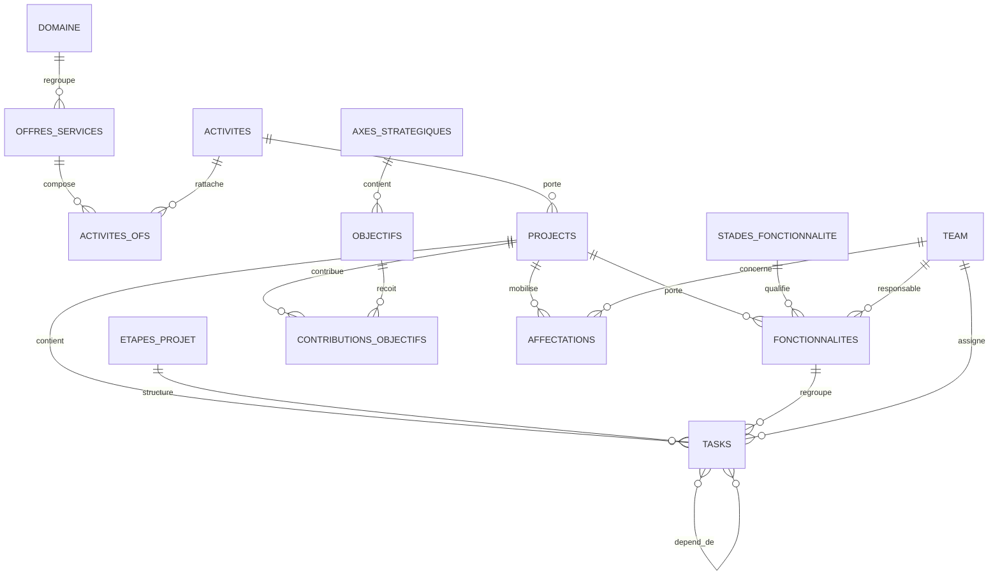

# MCD — GRIST. COCKPIT Pilotage PMO
**Version 4.7.7 — 13 août 2026**

## Vue conceptuelle

## Règles métier consolidées
- `Projects` représente soit un **Projet**, soit un **Produit**.
- **Projet** : borné (`dateDebut`, `dateFin`), piloté par `Etapes_Projet`.
- **Produit** : potentiellement non borné, sans étape projet, piloté par `Fonctionnalites`.
- Une `Fonctionnalite` peut appartenir à un Projet ou à un Produit.
- Une fonctionnalité possède `stade`, `Date_Debut`, `Date_Fin`, éventuellement `Date_Cible`, `Progression`, `Priorite`, `Responsable`.
- Une tâche Projet référence `etape_projet` et peut aussi référencer `fonctionnalite`.
- Une tâche Produit ne référence pas d'étape projet et peut référencer une fonctionnalité.
- `Tasks.dependDe` est une `RefList -> Tasks` globale : les dépendances peuvent être inter-projets/inter-produits.
- Le CRUD `Fonctionnalites` est **exclusivement dans le Cockpit**.
- `Stades_Fonctionnalite`, `Etapes_Projet`, `Domaine` et les autres référentiels restent administrés dans **Admin & Audit**.

## Chaîne Projet
`Domaine -> Offre de services -> Activité -> Projet -> Étape -> Tâche`

En parallèle : `Projet -> Fonctionnalité`, et une tâche peut pointer vers cette fonctionnalité.

## Chaîne Produit
`Domaine -> Offre de services -> Activité -> Produit -> Fonctionnalité -> Tâche`

Aucune étape projet.

## Dépendances transverses
`Projet A -> Tâche A3 -> dependDe -> Tâche B7 -> Projet B`

## Objets et responsabilités
| Objet | Nature | Relations clés |
|---|---|---|
| Projects | Métier | Activité, Tasks, Fonctionnalites, Objectifs, Affectations |
| Tasks | Métier | Projects, Etapes_Projet, Fonctionnalites, Team, Tasks(dependDe) |
| Fonctionnalites | Métier | Projects, Stades_Fonctionnalite, Team |
| Etapes_Projet | Référentiel | Tasks ; utilisé uniquement par les Projets |
| Stades_Fonctionnalite | Référentiel | Fonctionnalites |
| Domaine | Référentiel | Offres_Services |
| Offres_Services | Référentiel | Domaine, Activites_OFS |
| Activites | Référentiel | Activites_OFS, Projects |
| CONTRIBUTIONS_OBJECTIFS | Liaison | Projects <-> Objectifs |
| AFFECTATIONS | Liaison | Projects <-> Team |
